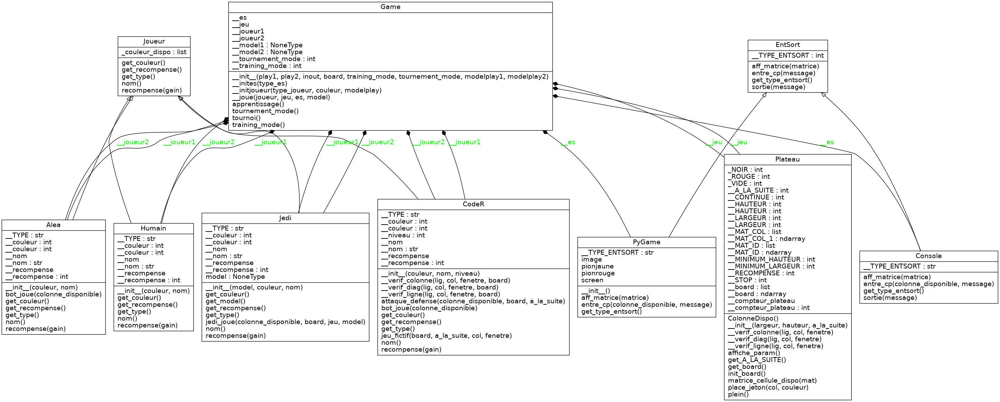

# Puissances 4 (reloaded)  

***AI Connect Agency*** a créé son jeu de société ***Connect4AI*** accompagné d'un bot ***JEDI*** qui apprend à jouer automatiquement !  

## Contexte  

Il nous a été demandé de développer un jeu de “puissance 4” similaire au jeu “4 in a row”.  
Dans ce jeu, deux joueurs s’affrontent. Ils doivent à tour de rôle poser un jeton dans une grille.  
Les jetons viennent se déposer dans l’emplacement libre le plus bas de la colonne choisie.  
Le joueur qui réussit à aligner 4 de ses jetons, dans n’importe quelle direction, gagne la partie !  

Le jeu est jouable dans les modes suivants :  
* Humain vs humain  
* Humain vs IA  
* IA vs IA  

Notre IA propose plusieurs niveaux de difficulté :  

* Bot ***alea*** trop facile ;-)
* Bot ***codeR4*** coriace !  
* Bot ***codeR43*** imbattable !!!  

La taille de la grille est paramétrable :  

* Attribut ***__LARGEUR*** de la classe Plateau (valeur par défaut = 7)  
* Attribut ***__HAUTEUR*** de la classe Plateau (valeur par défaut=6)  

Nous proposons TROIS types d'IA :  

* ***Aléatoire*** avec ALEA  
* ***BOT*** avec codeR4 & codeR43  
* ***DQN*** entraînée par renforcement avec JEDI  

## Structure  

Le programme est développé suivant 3 grandes parties :  

* Moteur de jeu avec ***game.py*** & ***joueur.py***  
* Partie graphique avec ***plateau.py*** & ***entsor.py***  
* Intelligence Artificielle avec ***DQN.py***  

Notre jeu s'exécute depuis un programme python simple ***connect4AI.py*** avec moins de 200 lignes de code !  
Afin d'anticiper la dette technique, notre code est modulaire, en POO avec les classes :  

* Plateau  

* Joueur  

)

* Game  

* Entsor  

* DQN  

Notre programme supporte plusieurs paramètres en ligne de commande permettant de :  

* Choisir le mode de jeu  
* Définir les dimensions du plateau  
* Options pour entraîner l'IA

Utilisation de connect4AI en ligne de commande:

$ python connect4AI --help 
usage: connect4AI.py [-h] [--play1 PLAY1] [--play2 PLAY2] [--inout INOUT] [--board BOARD BOARD BOARD] [--training_mode TRAINING_MODE] [--tournement_mode TOURNEMENT_MODE] [--modelplay1 MODELPLAY1] [--modelplay2 MODELPLAY2]

optional arguments:
  -h, --help            show this help message and exit
  --play1 PLAY1, -p1 PLAY1
                        --play1 "Humain" or "CodeR4" or "CodeR43" or "Jedi" or nothing (=Humain)
  --play2 PLAY2, -p2 PLAY2
                        --play2 "Humain" or "CodeR4" or "CodeR43" or "Jedi" or nothing (=Humain)
  --inout INOUT, -io INOUT
                        --inout "console" or "pygame" or "tkinter" or nothing (=console)
  --board BOARD BOARD BOARD, -b BOARD BOARD BOARD
                        --board integer integer integer
  --training_mode TRAINING_MODE, -trm TRAINING_MODE
                        --training_mode integer
  --tournement_mode TOURNEMENT_MODE, -tm TOURNEMENT_MODE
                        --tournement_mode integer
  --modelplay1 MODELPLAY1, -mp1 MODELPLAY1
                        --modelplay1 path/file.h5
  --modelplay2 MODELPLAY2, -mp2 MODELPLAY2
                        --modelplay2 path/file.h5

***Statistiques de JEDI : TBD***  

* Proportion de parties gagnées  
* Evolution du nombre de coups des parties  
* Evolution de la loss  

## Tests Unitaires et Fonctionnels  

Les tests permettent de vérifier un programme selon différents critères. Les tests unitaires et fonctionnels permettent d'automatiser la vérification de fonctions et de scénarios d'un programme automatiquement.  
Pour s'assurer qu'un cahier des charges est respecté mais Cela permet aussi de faciliter la détection et la correction de bugs lors de mises à jour ou de modifications du code.  

Nos tests, implémentés avec les modules ***unittest*** & ***pytest*** peuvent être lancés depuis :
* ./test_unitest/test_unit_plateau.py  
* ./test_unitaires/alignements.py  
* ./test_unitaires/test_entsor.py  
* ./test_unitaires/test_plateau.py  

## Modalités pédagogiques  

Travail en agence de développement organisée en mode ***Agile/Scrum*** :  

* [Cécilia](https://github.com/ccylia)  
* [Hachem](https://github.com/hachemmosbah)  
* [Olivier](https://github.com/Olivier-Prince)  
* [Roger](https://github.com/rog01)  
* [Jean-Pierre](https://github.com/jpphi)  

## Critères de performance  

Tournoi où les différentes agences s'affrontent !!!
Que le meilleur gagne ;-)

## Modalités d'évaluation  

* Les pairs [Anne-Laure](https://github.com/AnneLaureM) & [Adrien](https://github.com/dtrckd) pourront tester notre jeu ;-P  
* Revue de code  

## Livrables  

* Code source hebergé sous [GitHub](https://github.com/jpphi/brief19_connect4)  
* Tests (cf. section Tests unitaires & fonctionnels)  
* Documentation (cf. README.md)  

